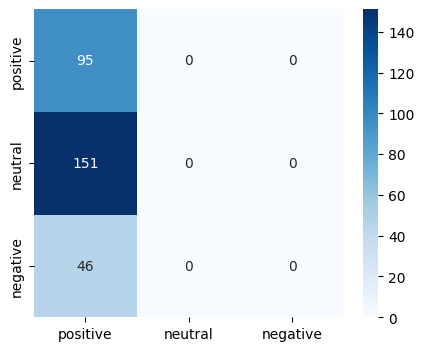

# BiGRU_Sentiment_Analysis
Sentiment Analysis using a Bi-directional Gated Recurrent Unit

The project tries to 
1. Compare the effects of word level embeddings and subword level embeddings when used to represent datat in the Financial Sentiment Analysis dataset
2. Try to use word2vec embeddings on Amazon User Feedback data

## Financial Sentimental Dataset [[1]](#1)

### Results with BiGRU Word Embeddings

Training Graph

Confusion Matrix

### Results with BiGRU Subword Embeddings

Training Graph

Confusion Matrix

The subword embeddings enables shorter encoding sizes, compositionality of subwords allowing us to form an interconnectednes between base and composite words. This leads to better performance.

## Amazon User Feedback Dataset
Could not get the model to converge

<a id="1">[1]</a> 
Pekka Malo, Ankur Sinha, Pyry Takala, Pekka Korhonen, and Jyrki Wallenius. Good debt or bad debt: Detecting semantic orientations in economic texts, 2013
